title: "gbforth"
controls: false
progress: true
theme: tkers/cleaver-theme-dmg

--

<style>
#slide-1 {
  text-align: center;
}
#slide-1 h3 {
  display: inline-block;
  border: 0;
  font-size: 100%;
  background-color: rgba(0, 0, 0, 0.4);
  color: #ffffff;
  padding: 0.2em 1em;
  border-radius: 40px;
  margin-top: 60px;
}
</style>

# gbforth

## A Forth-based Game Boy development kit

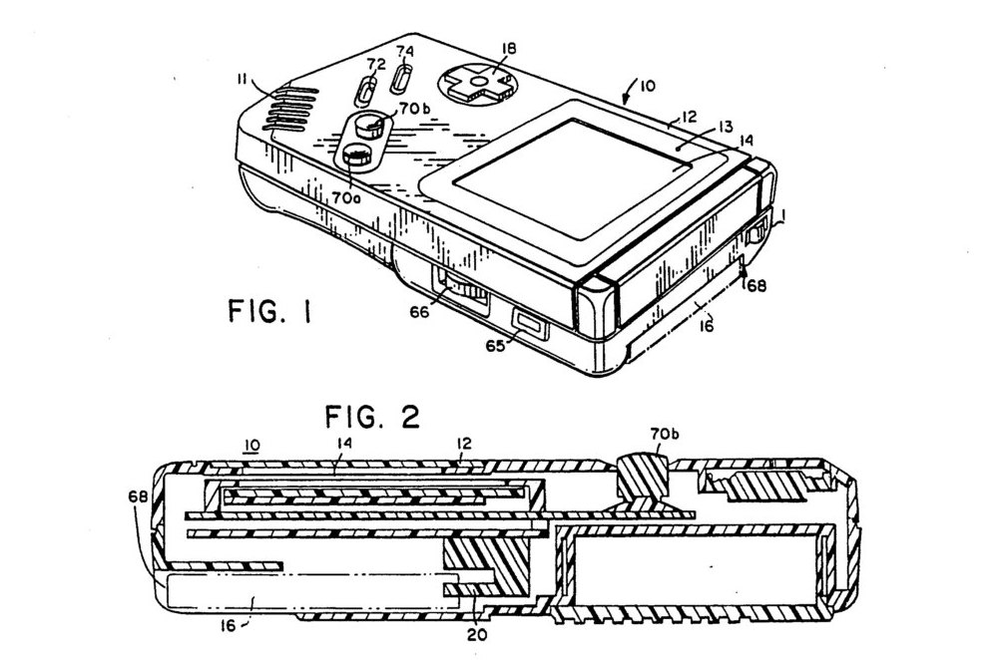

### David Vázquez Púa &bull; Tijn Kersjes

--

### Amsterdam Hackers


--

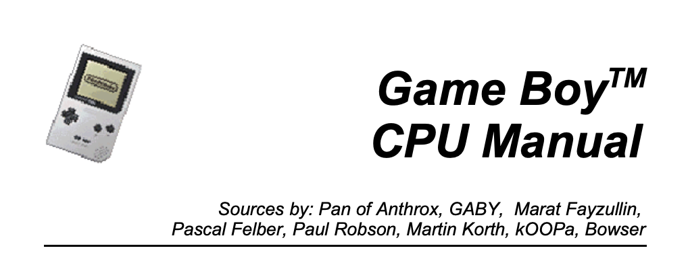

- Incremental development
- Short feedback cycle

--

### Reverse-engineer instead!

- Start with a working game
- Make program to emit binary
- Reverse engineer & refactor bytes
  - Add abstractions
  - Build libraries
- Write a compiler on top

--

### Why Forth?

- Stack based
- No syntax, just _numbers_ and _words_
- Grow your own language

```
4 1 + DUP * .
```

<small>_prints "25"_</small>

--

### Why Forth?

Concatenative language:

```
4 1 + .
```

Abstractions are simple:

<pre>
<b>: INC</b>
  1 + <b>;</b>

4 INC .
</pre>

--

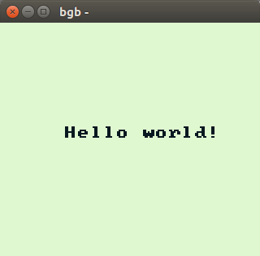

--

### ROM

```
$00  $c3  $50  $01  $ce  $ed  $66  $66
$cc  $0d  $00  $0b  $03  $73  $00  $83
$00  $0c  $00  $0d  $00  $08  $11  $1f
$88  $89  $00  $0e  $dc  $cc  $6e  $e6
$dd  $dd  $d9  $99  $bb  $bb  $67  $63
$6e  $0e  $ec  $cc  $dd  $dc  $99  $9f
$bb  $b9  $33  $3e  $45  $58  $41  $4d
$50  $4c  $45  $00  $00  $00  $00  $00
$00  $00  $00  $00  $00  $00  $00  $00
$00  $00  $01  $33
```

--

### Forth code that emits ROM

<pre>
$00 <span style="color: #0000dd">c,</span> $c3 <span style="color: #0000dd">c,</span> $50 <span style="color: #0000dd">c,</span> $01 <span style="color: #0000dd">c,</span> $ce <span style="color: #0000dd">c,</span> $ed <span style="color: #0000dd">c,</span> $66 <span style="color: #0000dd">c,</span> $66 <span style="color: #0000dd">c,</span>
$cc <span style="color: #0000dd">c,</span> $0d <span style="color: #0000dd">c,</span> $00 <span style="color: #0000dd">c,</span> $0b <span style="color: #0000dd">c,</span> $03 <span style="color: #0000dd">c,</span> $73 <span style="color: #0000dd">c,</span> $00 <span style="color: #0000dd">c,</span> $83 <span style="color: #0000dd">c,</span>
$00 <span style="color: #0000dd">c,</span> $0c <span style="color: #0000dd">c,</span> $00 <span style="color: #0000dd">c,</span> $0d <span style="color: #0000dd">c,</span> $00 <span style="color: #0000dd">c,</span> $08 <span style="color: #0000dd">c,</span> $11 <span style="color: #0000dd">c,</span> $1f <span style="color: #0000dd">c,</span>
$88 <span style="color: #0000dd">c,</span> $89 <span style="color: #0000dd">c,</span> $00 <span style="color: #0000dd">c,</span> $0e <span style="color: #0000dd">c,</span> $dc <span style="color: #0000dd">c,</span> $cc <span style="color: #0000dd">c,</span> $6e <span style="color: #0000dd">c,</span> $e6 <span style="color: #0000dd">c,</span>
$dd <span style="color: #0000dd">c,</span> $dd <span style="color: #0000dd">c,</span> $d9 <span style="color: #0000dd">c,</span> $99 <span style="color: #0000dd">c,</span> $bb <span style="color: #0000dd">c,</span> $bb <span style="color: #0000dd">c,</span> $67 <span style="color: #0000dd">c,</span> $63 <span style="color: #0000dd">c,</span>
$6e <span style="color: #0000dd">c,</span> $0e <span style="color: #0000dd">c,</span> $ec <span style="color: #0000dd">c,</span> $cc <span style="color: #0000dd">c,</span> $dd <span style="color: #0000dd">c,</span> $dc <span style="color: #0000dd">c,</span> $99 <span style="color: #0000dd">c,</span> $9f <span style="color: #0000dd">c,</span>
$bb <span style="color: #0000dd">c,</span> $b9 <span style="color: #0000dd">c,</span> $33 <span style="color: #0000dd">c,</span> $3e <span style="color: #0000dd">c,</span> $45 <span style="color: #0000dd">c,</span> $58 <span style="color: #0000dd">c,</span> $41 <span style="color: #0000dd">c,</span> $4d <span style="color: #0000dd">c,</span>
$50 <span style="color: #0000dd">c,</span> $4c <span style="color: #0000dd">c,</span> $45 <span style="color: #0000dd">c,</span> $00 <span style="color: #0000dd">c,</span> $00 <span style="color: #0000dd">c,</span> $00 <span style="color: #0000dd">c,</span> $00 <span style="color: #0000dd">c,</span> $00 <span style="color: #0000dd">c,</span>
$00 <span style="color: #0000dd">c,</span> $00 <span style="color: #0000dd">c,</span> $00 <span style="color: #0000dd">c,</span> $00 <span style="color: #0000dd">c,</span> $00 <span style="color: #0000dd">c,</span> $00 <span style="color: #0000dd">c,</span> $00 <span style="color: #0000dd">c,</span> $00 <span style="color: #0000dd">c,</span>
$00 <span style="color: #0000dd">c,</span> $00 <span style="color: #0000dd">c,</span> $01 <span style="color: #0000dd">c,</span> $33 <span style="color: #0000dd">c,</span>
</pre>

--

### Find the patterns and meaning

<pre>
$00 c, $c3 c, $50 c, $01 c, <span style="color: #0000dd">$ce c, $ed c, $66 c, $66 c,
$cc c, $0d c, $00 c, $0b c, $03 c, $73 c, $00 c, $83 c,
$00 c, $0c c, $00 c, $0d c, $00 c, $08 c, $11 c, $1f c,
$88 c, $89 c, $00 c, $0e c, $dc c, $cc c, $6e c, $e6 c,
$dd c, $dd c, $d9 c, $99 c, $bb c, $bb c, $67 c, $63 c,
$6e c, $0e c, $ec c, $cc c, $dd c, $dc c, $99 c, $9f c,
$bb c, $b9 c, $33 c, $3e c,</span> <span style="color: #dd0000">$45 c, $58 c, $41 c, $4d c,
$50 c, $4c c, $45 c, $00 c, $00 c, $00 c, $00 c, $00 c,
$00 c, $00 c, $00 c, $00 c, $00 c, $00 c, $00 c, $00 c,</span>
$00 c, $00 c, $01 c, $33 c,
</pre>

--

### Abstract data into definitions

<pre>
<span style="color: #0000dd"><b>: logo</b>
  $ce c, $ed c, $66 c, $66 c, $cc c, $0d c, $00 c, $0b c,
  $03 c, $73 c, $00 c, $83 c, $00 c, $0c c, $00 c, $0d c,
  $00 c, $08 c, $11 c, $1f c, $88 c, $89 c, $00 c, $0e c,
  $dc c, $cc c, $6e c, $e6 c, $dd c, $dd c, $d9 c, $99 c,
  $bb c, $bb c, $67 c, $63 c, $6e c, $0e c, $ec c, $cc c,
  $dd c, $dc c, $99 c, $9f c, $bb c, $b9 c, $33 c, $3e c, <b>;</b></span>

<span style="color: #dd0000"><b>: title</b>
  $45 c, $58 c, $41 c, $4d c, $50 c, $4c c, $45 c, $00 c,
  $00 c, $00 c, $00 c, $00 c, $00 c, $00 c, $00 c, $00 c, <b>;</b></span>

$00 c, $c3 c, $50 c, $01 c,
<span style="color: #0000dd">logo</span>
<span style="color: #dd0000">title</span>
$00 c, $00 c, $01 c, $33 c,

</pre>

--

### Decompiling machine code

- `INC-A` translates to `$3c`
- `INC-B` translates to `$04`

--

### Decompiling machine code

- `INC-A` translates to `%00111100`
- `INC-B` translates to `%00000100`

--

### Decompiling machine code

- `INC-A` translates to `%00111100`
- `INC-B` translates to `%00000100`
- `INC-?` translates to `%.....100`

--

### Decompiling machine code

- `A INC,` emits `$3c`
- `B INC,` emits `$04`

<pre>
<b>: A</b> %00111000 <b>;</b>
<b>: B</b> %00000000 <b>;</b>

<b>: INC,</b>
  %00000100 OR c, <b>;</b>
</pre>

--

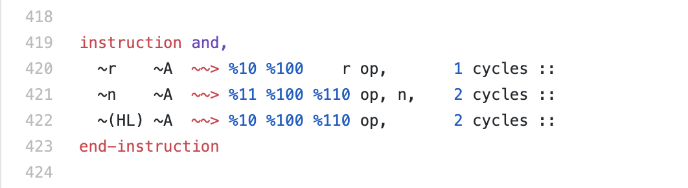

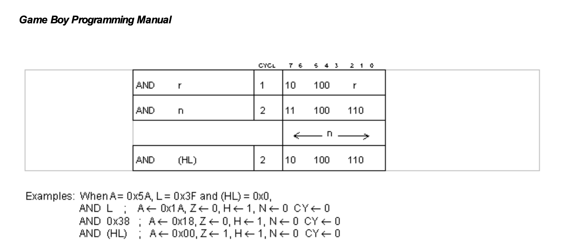

--

<center>
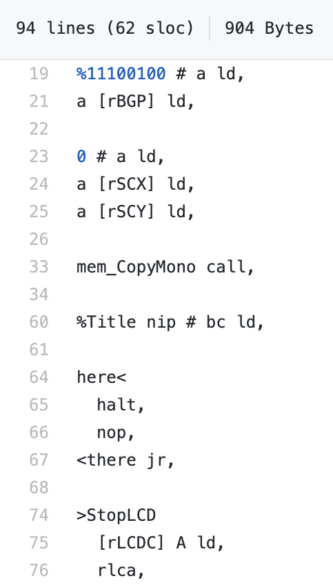
</center>

--

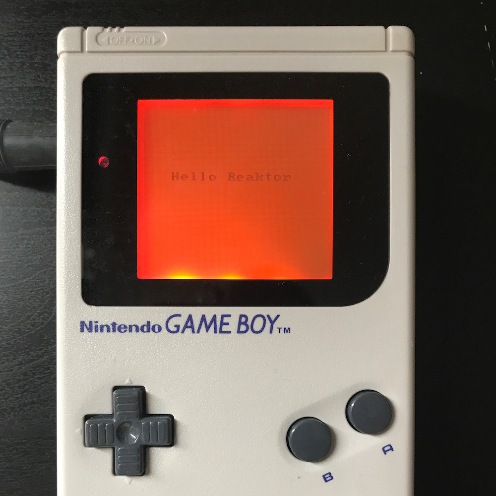

--

### Macros for free!

<pre>
<span style="color: #0000dd"><b>: reset-scroll</b>
  0 # a ld,
  a [rSCX] ld,
  a [rSCY] ld, <b>;</b></span>

di,
$ffff # sp ld,

%11100100 # a ld,
a [rGBP] ld,

<span style="color: #0000dd">reset-scroll</span>

<span style="color: #99bb99">( ... )</span>
</pre>

--

### Macros for free!

<pre>
<span style="color: #0000dd"><b>: reset-scroll</b>
  0 # a ld,
  a [rSCX] ld,
  a [rSCY] ld, <b>;</b></span>

<span style="color: #dd0000"><b>: reset-palette</b>
  %11100100 # a ld,
  a [rGBP] ld, <b>;</b></span>

di,
$ffff # sp ld,

<span style="color: #dd0000">reset-palette</span>

<span style="color: #0000dd">reset-scroll</span>

<span style="color: #99bb99">( ... )</span>
</pre>

--

### Implementing Forth

- Write a compiler
- Add code primitives (ASM)
- Create high level libraries (Forth)
- Rewriting _Hello World_ in Forth

--

<style>
img[alt=hello-asm],
img[alt=hello-forth] {
  width: 45%;
  display:inline-block;
  vertical-align:top;
}
</style>


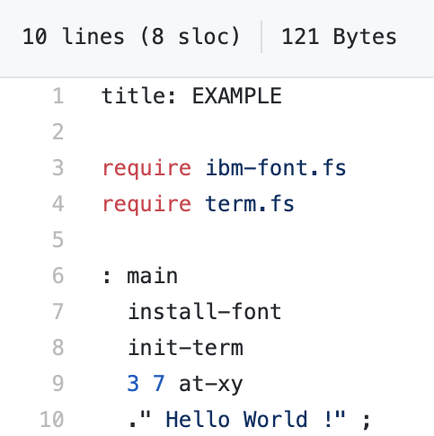

--

# The final test 💪

## Compiling a third party Forth game...

## &nbsp;

```fs
\ sokoban - a maze game in FORTH

\ Copyright (C) 1995,1997,1998,2003,2007,2012,2013,2015
\ Free Software Foundation, Inc.

\ This file is part of Gforth.

40 Constant /maze  \ maximal maze line

Create maze  1 cells allot /maze 25 * allot  \ current maze
Variable mazes   0 mazes !  \ root pointer
Variable soko    0 soko !   \ player position
Variable >maze   0 >maze !  \ current compiled maze

: maze-field ( -- addr n )
    maze dup cell+ swap @ chars ;

: .score ( -- )
    ." Level: " level# @ 2 .r ."  Score: " score @ 4 .r
    ."  Moves: " moves @ 6 .r ."  Rocks: " rocks @ 2 .r ;

: .maze ( -- )  \ display maze
    0 0 at-xy  .score
    cr  maze-field over + swap
    DO  I /maze type cr  /maze chars  +LOOP ;
```

--

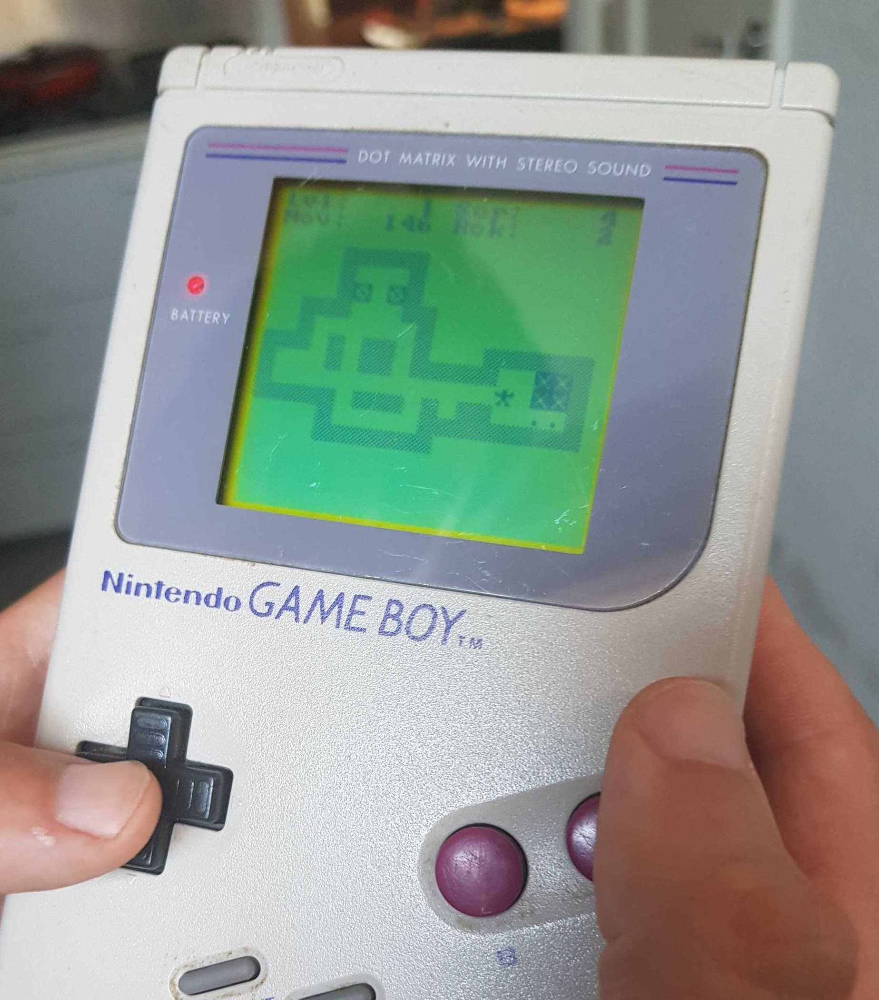

--

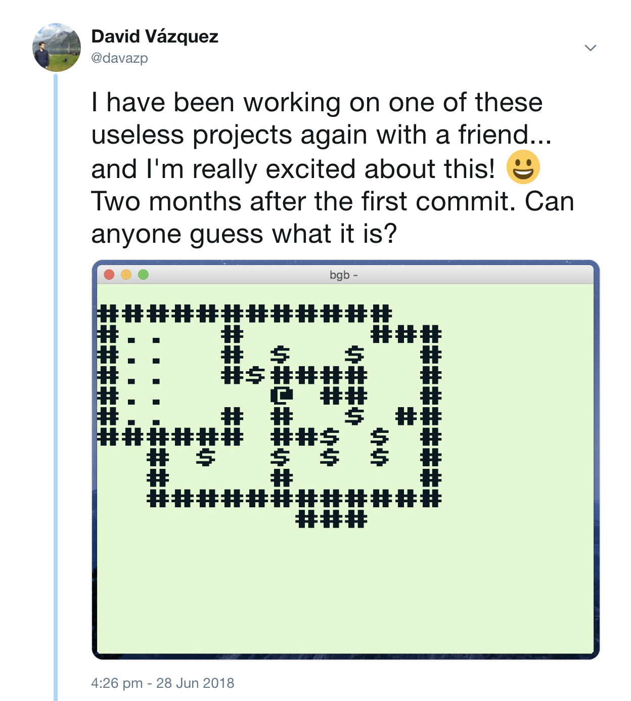

--

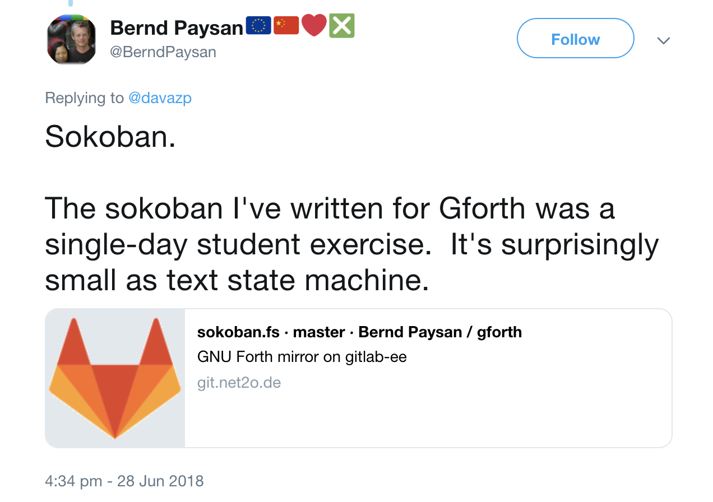

--

<style>
img[alt=snap] {
  width: 40%;
  display: inline-block;
}
</style>

<center>

<div style="margin: 0.5em">
[play.gbforth.org](https://play.gbforth.org)
</div>

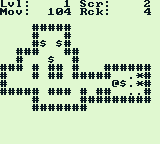
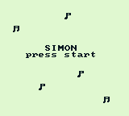
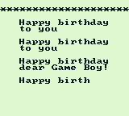
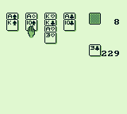

</center>

-- dark

<style>
.dark h1 {
  font-size: 200%;
  margin-top: 100px;
}
</style>

# BYE ;

- **[gbforth.org](https://gbforth.org)**
- [Reverse Engineering fine details of Game Boy hardware (@gekkio)](https://www.youtube.com/watch?v=GBYwjch6oEE)
- [The Ultimate Game Boy Talk](https://www.youtube.com/watch?v=HyzD8pNlpwI)

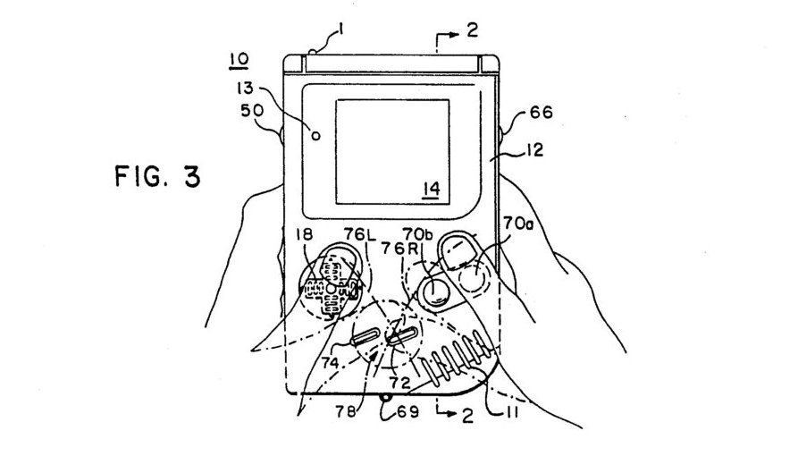
